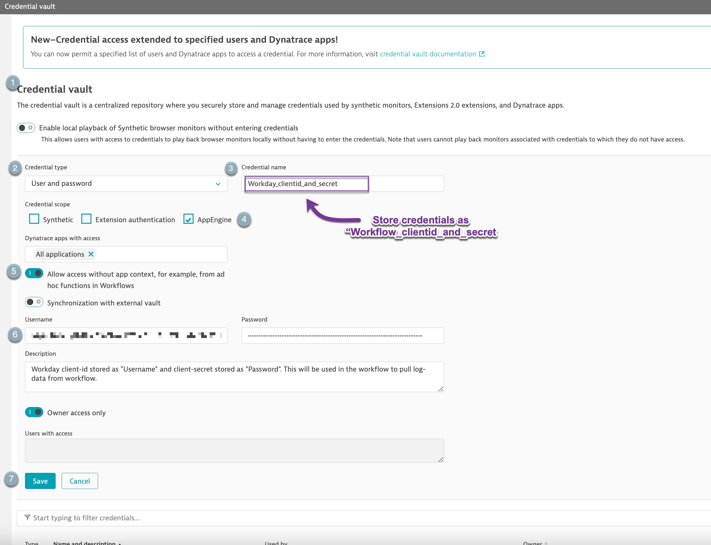

# Dynatrace Workday Integration

This solution integrates Workday logs with Dynatrace by pulling Workday logs and pushing them as business events (BizEvents) within Dynatrace. Follow the steps below to set up the integration:

### Steps to Implement

1. **Store Workday Credentials in Dynatrace Credentials Vault.**
2. **Upload and configure the workflow to pull log records from Workday.**
3. **Upload the dashboard to visualize the retrieved data.**

### Storing Credentials

To store the Workday credentials, use the Dynatrace Credentials Vault. The steps to do this are outlined [here](https://docs.dynatrace.com/docs/shortlink/credential-vault#access-cv).

1. **Client ID and Client Secret**:  
   Store the Workday client ID and client secret as `Workday_clientid_and_secret` within Dynatrace, as shown in the image below:  
   

2. **Refresh Token**:  
   Store the Workday refresh token as `Workday_refresh_token` within Dynatrace, as shown in the image below:  
   

⚠️ **Important**: Ensure that the credentials are stored with the exact names specified above. If necessary, update the names in Workday to match.

### Uploading the Workflow

Next, upload the [workflow](./workflow/wf_workday_workflow_00bf2742-fd39-41a3-baf6-c20e95a365dc.json) as detailed [here](https://docs.dynatrace.com/docs/shortlink/workflows-upload).

1. **Modify the Trigger Task**:  
   After uploading, change the trigger task from "On-demand" to "Time Interval" to schedule the workflow to run every **30 minutes**. More details on this can be found [here](https://docs.dynatrace.com/docs/shortlink/workflows-schedules#time-interval).

2. **Update the `workdayTokenURL` Endpoint**:  
   In the `generate_bearer_token` task, modify the `workdayTokenURL` to point to your Workday endpoint, which will be used to generate the bearer token.

   Code snippet for generate bearer token:  
   ```javascript
   async function getBearerToken(endpoint, clientCredentials, refreshToken) {
     try {
       const headers = {
         'Authorization': `Basic ${btoa(clientCredentials["username"] + ':' + clientCredentials["password"])}`,
         'Content-Type': 'application/x-www-form-urlencoded'      
       };

       const urlencoded = new URLSearchParams();
       urlencoded.append("grant_type", "refresh_token");
       urlencoded.append("client_id", clientCredentials["username"]);
       urlencoded.append("refresh_token", refreshToken);

       const response = await fetch(endpoint, {
         method: "POST",
         headers: headers,
         body: urlencoded
       });

       console.log(urlencoded);
       console.log(headers);
       
       if (!response.ok) {
         throw new Error(`HTTP error! status: ${response.status}`);
       }

       const data = await response.json();
       return data.access_token;
     } catch (error) {
       console.error(`Error fetching bearer token: ${error.message}`);
       throw error;
     }
   }
   ```
  4. Update the baseUrl in the pull_logs_push_as_bizevents Task:
     Modify the baseUrl in the pull_logs_push_as_bizevents task to match the correct Workday endpoint. This will be used to retrieve logs from Workday, with a offset of 1,000 records.

     Code snippet for pulling logs:
  ```
    async function getLogs(endpoint, bearerToken) {
    console.log(`Starting request to ${endpoint} at ${new Date().toISOString()}`);
  
    const myHeaders = new Headers();
    myHeaders.append("Authorization", `Bearer ${bearerToken}`);
    
    try {
      const response = await fetch(endpoint, {
        method: "GET",
        headers: myHeaders
      });
      console.log(`Completed request to ${endpoint} at ${new Date().toISOString()}`);
  
      if (!response.ok) {
        throw new Error(`HTTP error! status: ${response.status}`);
      }
      
      return await response.json();
    } catch (error) {
      throw error;
     }
    }
  ```
4.Push Logs as BizEvents:
  Once the logs are successfully pulled, task will push the Dynatrace BizEvent SDK to push the logs as BizEvents.
  ```
  try {
    await businessEventsClient.ingest({
      body: log,
      type: 'application/json',
    });
  } catch (error) {
  console.error('Failed to ingest event:', log);
  }
```
The workflow will automatically run every 30 minutes, pulling the data from the last 30 minutes and pushing it as BizEvents.  

## Uploading the Dashboard
Finally, upload the dashboard from (./Dashboard/Workday.json) to visualize the pulled data. Customize the dashboard as needed. The pushed BizEvents can be accessed using a simple DQL query.  
```
fetch bizevents
   | filter event.provider == "workday"
```


💡 If the workflow times out, increase the Workday API throttle limits. Follow these steps:

Increase HR Integrations Web Service Timeout:
Within the Activity Designer, increase the HR Integrations Web Service timeout from 65 seconds to a higher value. Ensure the record with Published set to true is updated.

Navigate to Activity Designer:

Go to HR Integrations Web Service.
Set Execution Command -> Timeout(secs) to 300 seconds (for example). Refer to the KB article on socket timeout errors during Workflow Activity execution.
Adjust Pagination for the Web Service Function:
Modify the <bsvc:Count> in the Get All Workers function as needed. Refer to the HR Integrations FAQ for details.

Update System Properties:

Set property-glide.http.outbound.max_timeout.enabled to false.
Adjust the values for glide.http.connection_timeout, glide.http.outbound.max_timeout, and glide.http.timeout to higher values.
Check Outbound HTTP Requests:
Review the outbound web service response times from Workday under 'Outbound HTTP Requests'.


   
